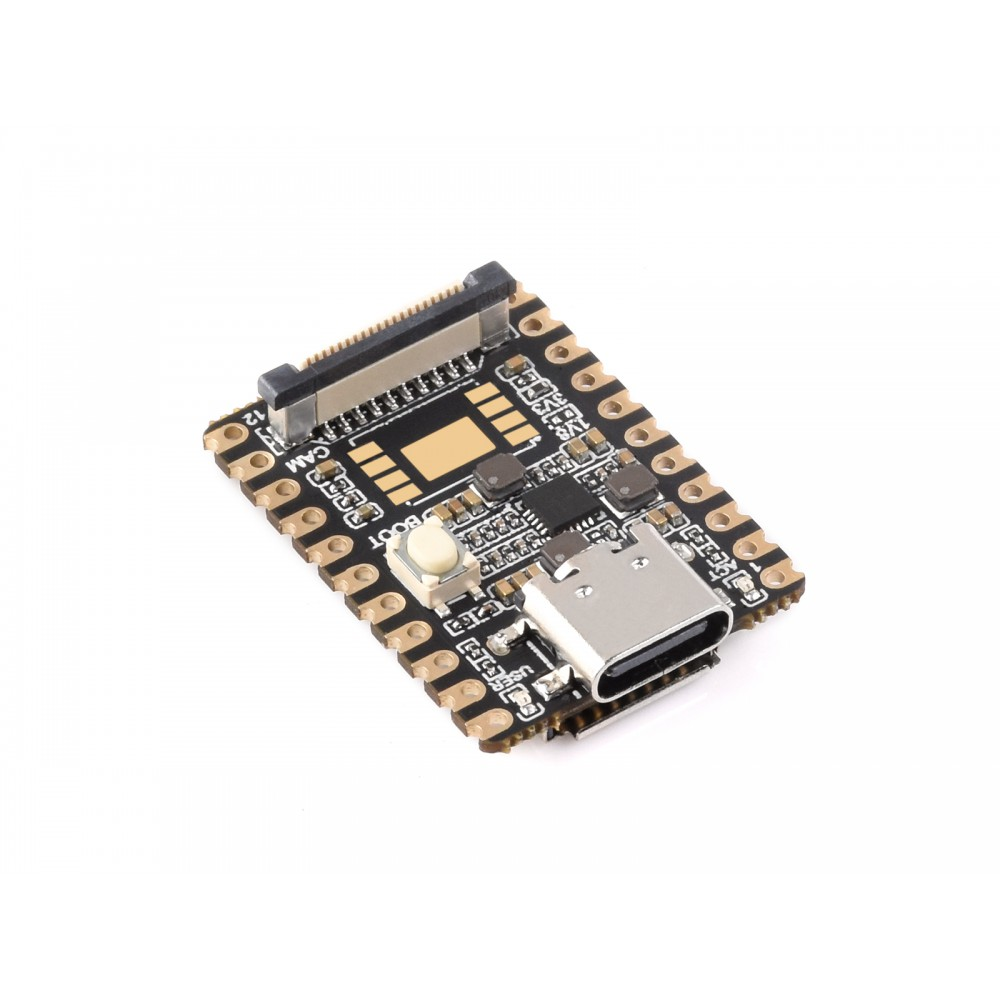
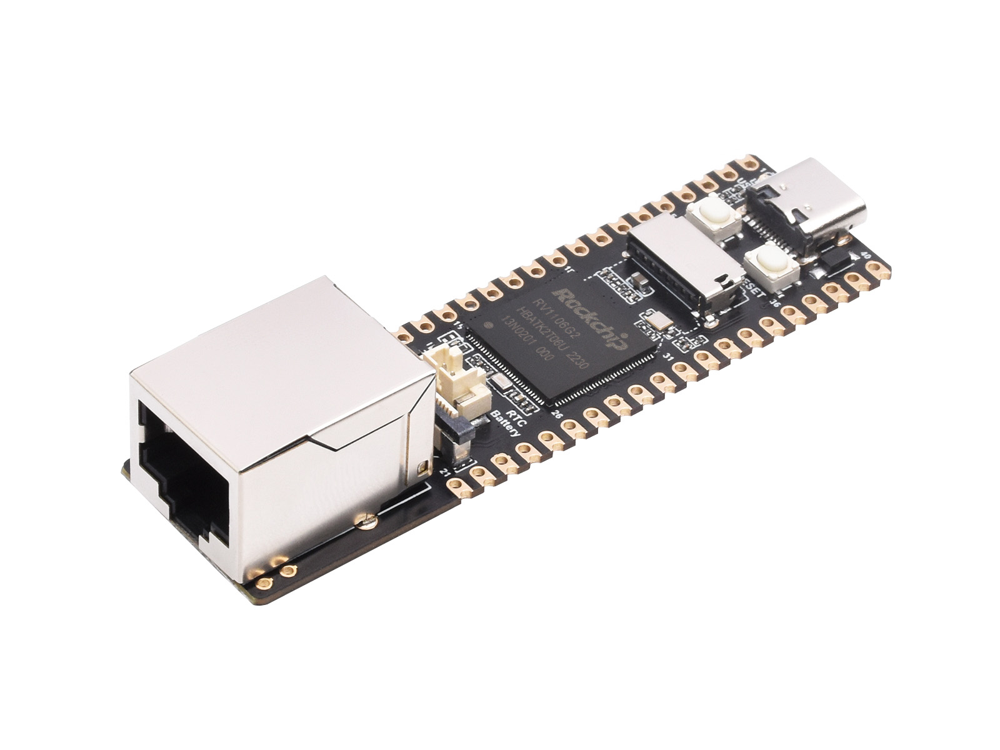
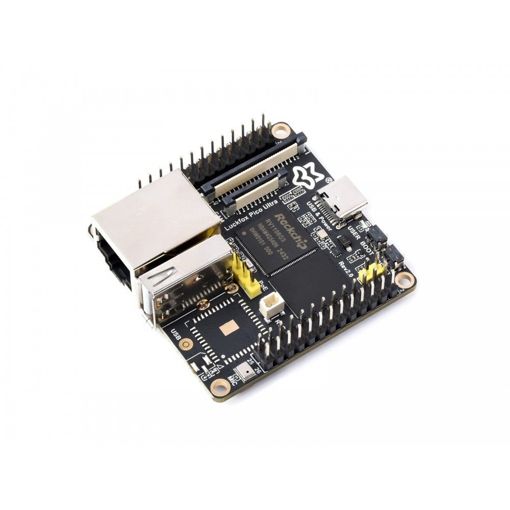
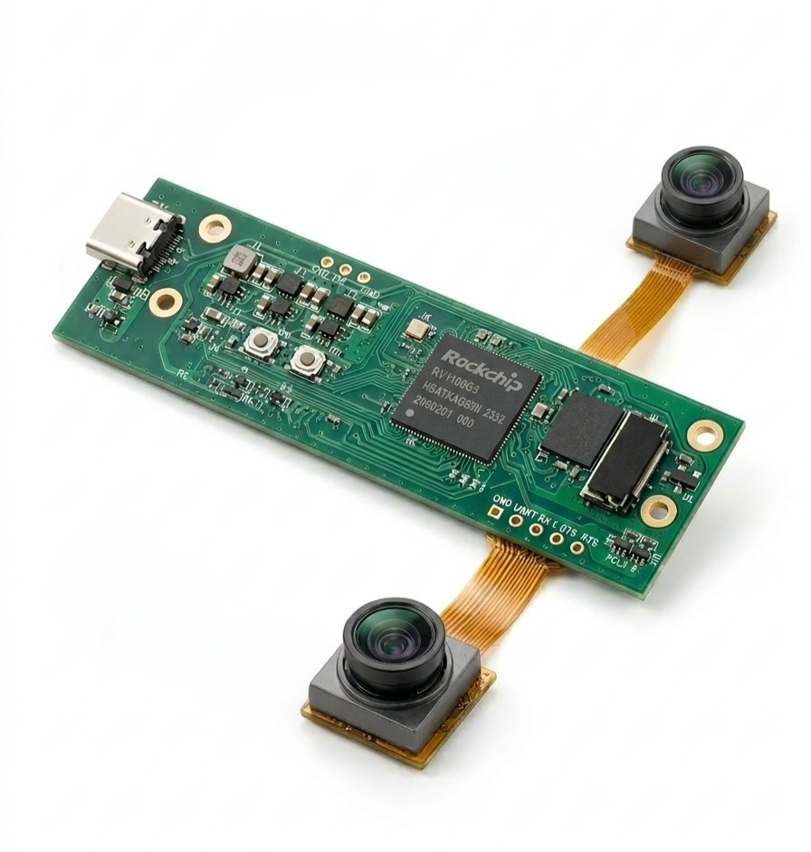

### Buildroot for RV1106

This Buildroot setup is tailored for **Rockchip RV1106**–based boards. It helps you quickly build complete,
customized embedded Linux images for:

- **Luckfox Pico Mini**
- **Luckfox Pico Max**
- **Luckfox Pico Ultra**
- **O(log n) Eyedra**

### Supported Boards

<table>
  <tr>
    <td>
      
      <br /><b>Luckfox Pico Mini</b>
      <br />luckfox_pico_mini_defconfig<br />
    </td>
    <td>
      
      <br /><b>Luckfox Pico Max</b>
      <br />luckfox_pico_max_defconfig<br />
    </td>
    <td>
      
      <br /><b>Luckfox Pico Ultra</b>
      <br />luckfox_pico_ultra_defconfig<br />
    </td>
    <td>
      
      <br /><b>O(log n) Eyedra</b>
      <br />eyedra_defconfig<br />
    </td>
  </tr>
</table>

### Quick Start

1. **Select your board defconfig**

   ```bash
   # Choose one of the following:
   make luckfox_pico_mini_defconfig
   make luckfox_pico_max_defconfig
   make luckfox_pico_ultra_defconfig
   make eyedra_defconfig
   ```

2. **Customize configuration (optional but recommended)**

   ```bash
   make menuconfig
   ```

   In `menuconfig`, you can:
   - Enable/disable packages
   - Adjust filesystem type and size
   - Tweak kernel options and drivers
   - Select toolchain options

3. **Build the full image**

   ```bash
   make
   ```

4. **Find the generated artifacts**

   ```bash
   output/images
   ```

   Typically includes:
   - Kernel image
   - Bootloader
   - Root filesystem image(s)
   - Additional board‑specific artifacts (e.g. DTB, firmware)

### Additional Supported Camera Sensors

This RV1106 Buildroot configuration added support for these camera sensors:

- **OV6211 (dual)**
- **OX03C10**
- **OV2312**
- **OG02B10**
- **IMX219**
